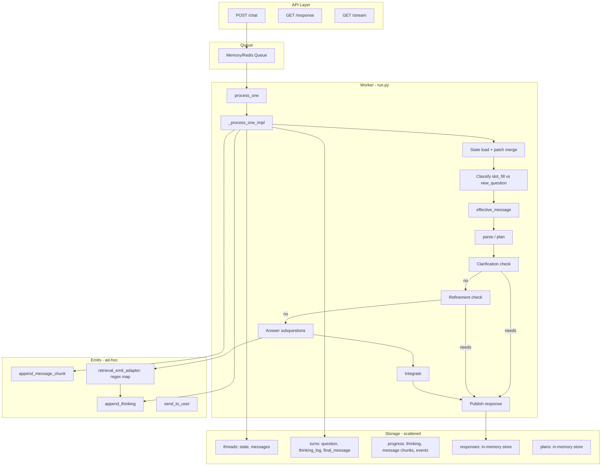

# Mobius Chat Module: Refactor Plan

A schematic of the current structure, pain points, and a map to a clean end-state: structured modules, consistent emits, no shortcuts or patches, clear progression, and proper technical + user-friendly message persistence.

---

## 1. Current Structure Schematic

### 1.1 Directory Layout

```
mobius-chat/
├── app/
│   ├── main.py                 # FastAPI: POST /chat, GET /response, GET /stream
│   ├── config.py               # Queue type, Redis URL
│   ├── chat_config.py          # RAG config, prompts, LLM provider (singleton)
│   ├── trace_log.py            # CHAT_DEBUG_TRACE: trace_entered/trace_log (sparse)
│   ├── payer_normalization.py  # Payer alias → canonical for RAG filter
│   │
│   ├── worker/
│   │   ├── run.py              # ~630 lines: process_one, _process_one_impl, _answer_for_subquestion
│   │   └── __main__.py
│   │
│   ├── queue/                  # MemoryQueue | RedisQueue
│   ├── storage/                # Turns, feedback, plans, responses, threads, progress, retrieval_persistence
│   ├── state/                  # Clarification, jurisdiction, refined_query, state_extractor, context_*
│   ├── planner/                # Parser, blueprint, schemas
│   ├── communication/          # gate (send_to_user), agent (format_clarification, format_refinement_ask)
│   ├── responder/              # format_response (integrator LLM)
│   └── services/               # non_patient_rag, retriever_backend, doc_assembly, llm_provider, retrieval_emit_adapter
```

### 1.2 Data Flow (Current)



### 1.3 State Model (Current – Patch-Based)

| Concept | Where | Shape | Notes |
|---------|-------|-------|-------|
| **Thread state** | `chat_state.state_json` | `{active, open_slots, refined_query, ...}` | Updated via **patches** (shallow merge) |
| **active** | Nested in state | `{payer, jurisdiction, jurisdiction_obj, domain, user_role}` | Dual representation: legacy flat + jurisdiction_obj |
| **refined_query** | state.refined_query | string | Set on clarification return, slot_fill merge, or new question |
| **open_slots** | state.open_slots | `["jurisdiction.payor", ...]` | Cleared/fulfilled via extract_state_patch; also register_open_slots |

**Patch flow**: `extract_state_patch(message, state)` → patch dict → `save_state(thread_id, patch)` → read current, shallow merge, write. Multiple `save_state` calls per turn (register_open_slots, refined_query, etc.).

### 1.4 Emit Flow (Current)

| Source | Path | User sees | Technical |
|--------|------|-----------|-----------|
| Planner | `on_thinking` → `append_thinking` | Raw LLM/parser output | Same |
| Retrieval | RAG/retriever → `wrap_emitter_for_user` → `append_thinking` | Regex-mapped or omitted | CHAT_DEBUG_RETRIEVAL_EMITS=1 for raw |
| Integrator | `format_response` → `append_message_chunk` | Final answer | Same |
| Clarification | `format_clarification` (LLM) → `append_message_chunk` | Formatted ask | Same |

**Gaps**: No correlation_id in trace; technical vs user-friendly split is regex-based in one adapter; progress (thinking, chunks) stored in memory + optionally Redis + optionally DB, with no single schema.

### 1.5 Persistence (Current)

| What | Where | When |
|------|-------|------|
| Turn summary | `chat_turns` | insert_turn at end of turn |
| User + assistant messages | `chat_turn_messages` | append_turn_messages (after clarification, refinement, or full response) |
| Progress (thinking, chunks) | In-memory `_progress` | append_thinking, append_message_chunk |
| Progress (Redis) | PUBLISH to channel | When queue_type=redis |
| Progress (DB) | `chat_progress_events` | When queue_type=redis, in background thread |
| State | `chat_state` | save_state (multiple patches per turn) |
| Response | In-memory `_store` | store_response (for poll) |
| Plan | In-memory `_store` | store_plan |

**Shortcuts**:
- No DB → in-memory only for state, threads, turns; progress may not persist
- Multiple storage backends with different schemas
- `append_turn_messages` called with different semantics for clarification vs full answer

---

## 2. Pain Points and Shortcuts

### 2.1 Structural

- **Monolithic worker**: `run.py` ~630 lines; state load, classification, clarification, refinement, answer loop, integration, persistence all in one file
- **Patch-based state**: Shallow merge of patches is error-prone; order of `save_state` calls matters; `refined_query` fallback from `last_turn` when state not persisted is a workaround
- **Scattered storage**: `threads`, `turns`, `progress`, `responses`, `plans`, `feedback`, `retrieval_persistence` – no single abstraction
- **Dual jurisdiction model**: `active.payer` + `active.jurisdiction_obj` + `active.jurisdiction` (legacy) – multiple sources of truth

### 2.2 Emits and Progression

- **Ad-hoc thinking**: Each service emits raw strings; `retrieval_emit_adapter` does regex substitution; no structured event types
- **No progression schema**: Thinking log is a list of strings; no stages, timestamps, or correlation to modules
- **Technical vs user**: Single regex map; when it fails, technical leaks to UI
- **Trace**: `trace_log` exists but sparse; no correlation_id; no full module coverage

### 2.3 Persistence

- **Progress split**: In-memory + Redis + DB with different code paths; hard to reason about
- **Turn vs messages**: `insert_turn` (summary) vs `append_turn_messages` (user+assistant); not always in sync
- **No technical log persistence**: Debug/trace events not stored for post-hoc analysis

---

## 3. End-State Architecture

### 3.0 Unit of Work and Resolution Model

**Unit of work = resolution to a user question.** The pipeline is not "done" until we have answered the user's question. Until then, we stay in a refinement loop.

**Refinement loop:**
- Load/update state from user message
- Build or update the **blueprint** (plan with subquestions)
- Check: **Can we resolve?** (jurisdiction clear? blueprint unambiguous? no clarification needed?)
- If not: ask for clarification (jurisdiction, or blueprint/refinement)
- Persist the turn (question + assistant message); user responds
- Loop: next message re-enters, we refine **question** and **blueprint** together
- When resolvable: route each subquestion to an agent, answer, integrate, publish

**Blueprint clarification:** We may clarify the *blueprint* itself (e.g. "Did you mean X or Y?")—not just jurisdiction. The blueprint can be updated based on user confirmation or rephrase.

**Agent paths (subquestion routing):**

| Path | Description | Status |
|------|-------------|--------|
| **rag** | **Default path.** Policy/process lookup from corpus; broad coverage. Has built-in Google search fallback when corpus confidence is low. | Implemented |
| **patient** | Personal/patient-specific (e.g. "my prior auth status") | Stub: "I can't access your records" |
| **clinical** | Clinical/medical reasoning (e.g. dosing, guidelines) | Stub: future |
| **tool** | Explicit tool invocations: NPI lookup, scrape URL, etc. (MCP skills) | Stub: future |

**RAG is the default path**—most policy/process questions route here. RAG already falls back to Google search when corpus confidence is low ([doc_assembly.py](mobius-chat/app/services/doc_assembly.py) `apply_google_fallback`), so we're covered for search-augmentation there.

Each subquestion has a `path`. The orchestrator routes to the appropriate agent; stubs return a placeholder until implemented.

**Path capabilities and parser input**

- **Capability registry**: Each path declares what it can answer. Example:
  - **rag**: policy lookup, appeals, grievances, prior auth process, eligibility criteria, contact info, utilization management, claims, benefits (from corpus); **Google search fallback** when corpus confidence is low
  - **patient**: (stub) none
  - **clinical**: (stub) none
  - **tool**: NPI lookup (NPPES/Medicaid), provider data, web scrape (page/tree), simple LLM call (future MCP skills)
- **Parser input**: The planner/parse LLM call receives the capability list as part of its context. It uses this to:
  - **Route correctly**: Assign subquestions only to paths that can handle them
  - **Streamline questions**: Decompose and phrase subquestions to fit each path’s capabilities
  - **Avoid dead ends**: Don’t create subquestions for capabilities we don’t have; ask for clarification or say “I can’t” instead
- **Single source of truth**: Capabilities live in a config or module (e.g. `agents/capabilities.py`); parser prompt is built from it. Adding a new capability or path only requires updating the registry.

**Example capability registry (conceptual):**

```python
PATH_CAPABILITIES = {
    "rag": [
        "policy lookup", "appeals process", "grievances", "prior auth",
        "eligibility criteria", "contact info", "utilization management",
        "claims", "benefits", "member handbook",
        "Google search fallback when corpus confidence is low"
    ],
    "patient": [],  # stub
    "clinical": [],  # stub
    "tool": ["NPI lookup (NPPES/Medicaid)", "provider data", "web scrape", "simple LLM call"],
}
```

The parser prompt includes: "Available paths and what they can answer: rag: [...]; patient: [...]; ..." so the LLM decomposes the question into subquestions that match supported capabilities.

**Refinement loop flowchart:** `assets/chat_refinement_loop_flowchart.png` (in repo assets/)

**Refinement loop (text flowchart):**

```
[User message] --> [State load: apply delta from message]
       |
       v
[Classify: slot_fill vs new_question] --> [effective_message]
       |
       v
[Plan: parse or update blueprint from effective_message]
       |
       v
[Clarify: jurisdiction needed? blueprint ambiguous?]
       |
       +-- YES --> [Return clarification/refinement ask] --> [Save state + blueprint] --> [Exit; wait for next message]
       |
       +-- NO --> [Resolve: for each subquestion, route to agent]
                           |
                           +-- patient --> stub
                           +-- clinical --> stub
                           +-- rag --> retrieval + LLM (current)
                           +-- tool --> stub
                           |
       v
[Integrate: combine answers, format] --> [Publish response] --> [Done: unit of work complete]
```

### 3.1 Module Structure (Proposed)

```
mobius-chat/
├── app/
│   ├── api/                    # HTTP boundary
│   │   ├── routes.py           # POST /chat, GET /response, GET /stream
│   │   └── schemas.py          # Request/response models
│   │
│   ├── pipeline/               # Orchestration
│   │   ├── orchestrator.py     # Single entry: run_pipeline(correlation_id, message, thread_id)
│   │   ├── stages.py           # Stage definitions (state_load, classify, plan, clarify, answer, integrate)
│   │   └── context.py          # PipelineContext (correlation_id, thread_id, state, plan, etc.)
│   │
│   ├── stages/                 # One module per stage
│   │   ├── state_load.py       # Load + update state (no patches; explicit transitions)
│   │   ├── classify.py         # slot_fill vs new_question; effective_message
│   │   ├── plan.py             # Parse (with path capabilities in context), build/update blueprint
│   │   ├── clarify.py          # Jurisdiction + blueprint refinement; returns resolvable? + message
│   │   ├── resolve.py          # Route subquestions to agents, collect answers
│   │   ├── integrate.py        # Format response, combine answers
│   │   └── agents/             # Per-path handlers (stubs + implementations)
│   │       ├── capabilities.py # Registry: path -> list of capabilities (fed to parser)
│   │       ├── patient.py      # Stub: "I can't access your records"
│   │       ├── clinical.py     # Stub: future
│   │       ├── rag.py          # Current path: retrieval + LLM
│   │       └── tool.py         # Stub: non-RAG tools
│   │
│   ├── state/                  # State model (no patches)
│   │   ├── model.py            # ThreadState (dataclass), transitions
│   │   ├── jurisdiction.py     # Jurisdiction, rag_filters_from_state
│   │   └── extractor.py        # Extract from user text (pure functions → state delta)
│   │
│   ├── emit/                   # Structured emits
│   │   ├── types.py            # EmitEvent (stage, message, technical, user_friendly, ts)
│   │   ├── emitter.py          # Emitter interface; dual sink (technical + user)
│   │   └── adapter.py          # Module-specific technical → user mapping
│   │
│   ├── persistence/            # Unified persistence
│   │   ├── interface.py        # PersistencePort (turns, messages, progress, state)
│   │   ├── postgres.py         # Postgres implementation
│   │   └── memory.py           # In-memory fallback (explicit, no silent degradation)
│   │
│   ├── queue/                  # Unchanged
│   ├── services/               # RAG, LLM, doc_assembly (unchanged, but use emit types)
│   └── config/                 # chat_config, config
```

### 3.2 State Model (End-State)

- **ThreadState**: Single dataclass; no patch merge. Transitions: `load(thread_id)` → `apply_delta(delta)` → `save()`.
- **Delta**: Explicit changes from extractor (e.g. `{active: {payer: "Sunshine Health"}}`). No shallow merge of arbitrary dicts.
- **Jurisdiction**: One source of truth (`Jurisdiction` dataclass); no legacy vs jurisdiction_obj split.
- **Blueprint in context**: `PipelineContext` holds the current blueprint. It is built on first parse, then **updated** (not rebuilt from scratch) when the user clarifies or refines. Persisted with the turn so we can resume refinement across messages.

### 3.3 Emit Model (End-State)

```
EmitEvent:
  correlation_id: str
  stage: str           # e.g. "state_load", "retrieve", "integrate"
  message: str         # raw/technical
  level: "technical" | "user" | "both"
  ts: datetime
  extra: dict          # optional structured data
```

- **Technical sink**: Always log; optionally persist to `chat_emit_events` or trace file.
- **User sink**: Adapter maps technical → user; passes through `wrap_emitter_for_user`-style logic.
- **Progression**: Stage enum; each stage emits "start" and "end" events so we can reconstruct full flow.

### 3.4 Persistence (End-State)

| What | Table/Store | When |
|------|-------------|------|
| Turn | `chat_turns` | Once per completed turn; single insert |
| Messages | `chat_turn_messages` | Append user + assistant on every turn end (clarification, refinement, full) |
| State | `chat_state` | Single write per turn (full state, not patch) |
| Blueprint | `chat_state` or `chat_turns.plan_snapshot` | Persist with turn when we return clarification/refinement; reload on next message |
| Progress/Emits | `chat_progress_events` or `chat_emit_events` | Every emit; structured JSON |
| Response | In-memory (for poll) | Unchanged |

- **No silent fallback**: If DB unavailable, persistence layer raises or returns explicit "unavailable"; no in-memory silent save.
- **Single interface**: `PersistencePort` with methods `save_turn`, `append_messages`, `save_state`, `append_progress_event`.

---

## 4. Migration Map

### Phase 1: Extract and Formalize (Low Risk)

| Step | Action | Files |
|------|--------|-------|
| 1.1 | Extract `PipelineContext` (correlation_id, thread_id, message, state, plan) | New `pipeline/context.py` |
| 1.2 | Extract stages into functions (state_load, classify, plan, clarify, resolve, integrate); add agents/ stubs | New `stages/*.py`, `stages/agents/*.py`; call from worker |
| 1.3a | Add path capabilities registry; pass to parser as context | New `stages/agents/capabilities.py`; update planner prompt |
| 1.3 | Add `EmitEvent` and `Emitter` interface; wire existing emits through it | New `emit/`; refactor `retrieval_emit_adapter` |
| 1.4 | Add `PersistencePort` interface; implement with current storage (thin wrapper) | New `persistence/` |

### Phase 2: State Model (Medium Risk)

| Step | Action | Files |
|------|--------|-------|
| 2.1 | Introduce `ThreadState` dataclass; `apply_delta` replaces patch merge | `state/model.py` |
| 2.2 | Replace `extract_state_patch` with `extract_state_delta` (returns typed delta) | `state/extractor.py` |
| 2.3 | Unify jurisdiction: single `Jurisdiction` type; migrate from legacy | `state/jurisdiction.py` |
| 2.4 | Replace all `save_state(thread_id, patch)` with `state.apply_delta(delta); persistence.save_state(state)` | worker, stages |

### Phase 3: Persistence (Medium Risk)

| Step | Action | Files |
|------|--------|-------|
| 3.1 | Single `save_turn` that writes turn + messages atomically | `persistence/postgres.py` |
| 3.2 | Persist all emit events to `chat_emit_events` (or similar) when trace enabled | `persistence/`, `emit/` |
| 3.3 | Remove in-memory silent fallback; explicit "no DB" mode that logs and skips | `persistence/memory.py` |

### Phase 4: Orchestrator (Lower Risk After 1–3)

| Step | Action | Files |
|------|--------|-------|
| 4.1 | Implement `run_pipeline` in `orchestrator.py`; replace `_process_one_impl` body | `pipeline/orchestrator.py` |
| 4.2 | Worker calls `orchestrator.run_pipeline` | `worker/run.py` |
| 4.3 | Add stage-level trace with correlation_id; optional JSON output | `emit/`, `trace_log` |

### Phase 5: Cleanup

| Step | Action |
|------|--------|
| 5.1 | Remove patch-based logic, legacy jurisdiction fields |
| 5.2 | Consolidate progress (memory/Redis/DB) into persistence layer |
| 5.3 | Document emit schema and persistence schema for ops/debugging |

---

## 5. Emit and Persistence Schema (Ops/Debug)

**EmitEvent** (`app/emit/types.py`): `correlation_id`, `stage`, `message`, `level` (technical|user|both), `ts`, `extra`. Stages: `state_load`, `classify`, `plan`, `clarify`, `resolve`, `integrate`, `publish`.

**PersistencePort** (`app/persistence/interface.py`): `save_turn`, `append_messages`, `save_state`, `append_progress_event`. Implementations: `PostgresPersistence`, `MemoryPersistence` (explicit no-DB).

**Trace**: Set `CHAT_DEBUG_TRACE=1` for stage-level trace with `correlation_id` in logs.

---

## 6. Summary

| Dimension | Before Refactor | After Refactor |
|-----------|---------|-----------|
| **Unit of work** | Implicit (turn-based) | Explicit: resolution to user question; refinement loop until resolvable |
| **Blueprint** | Built once per turn, discarded on clarification | Built/updated across turns; persisted; can be clarified |
| **Agent paths** | patient (stub), non_patient (RAG) | patient, clinical, rag, tool (all with stubs; RAG implemented) |
| **Path capabilities** | Implicit in planner | Registry per path; parser receives as context; streamlines questions to fit |
| **Modules** | Monolithic worker, scattered state/storage | Pipeline + stages + agents, clear boundaries |
| **State** | Patch-based shallow merge, dual jurisdiction | Explicit deltas, single ThreadState |
| **Emits** | Ad-hoc strings, regex adapter | Structured EmitEvent, technical + user sinks |
| **Persistence** | Multiple backends, silent fallbacks | Single interface, explicit modes |
| **Progression** | Implicit in code flow | Stage enum, start/end events, trace by correlation_id |
